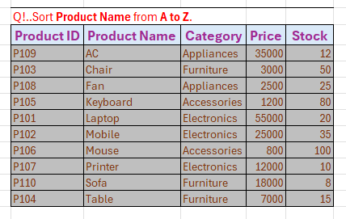
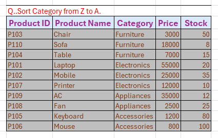
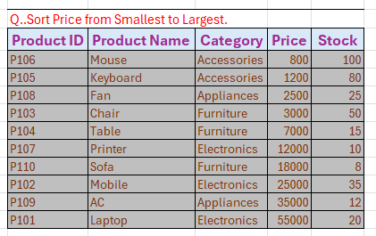
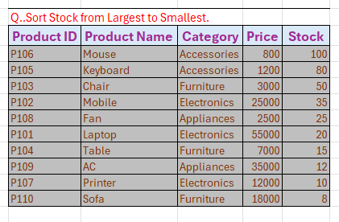
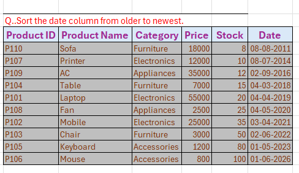
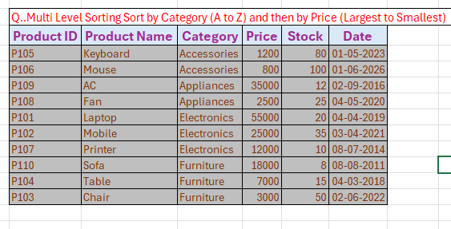
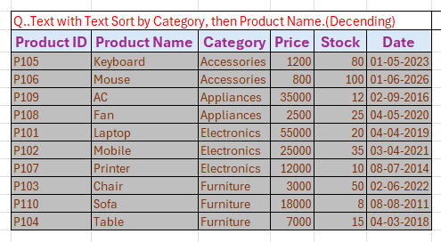
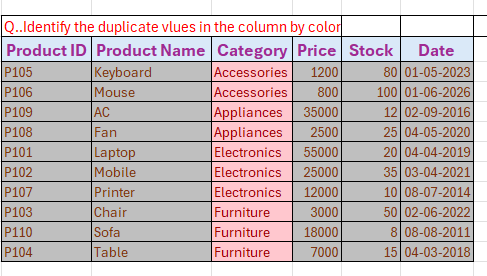
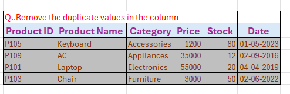

# 📊 Product Inventory Sorting Project

## 📌 Project Overview

This project demonstrates the use of Microsoft Excel Sorting and Data Management features on a Product Inventory dataset. The dataset contains product information such as Product ID, Product Name, Category, Price, Stock, and Date. Various sorting techniques and duplicate data management operations were performed to organize and analyze the inventory efficiently.

## Dataset Fields

- Product ID
- Product Name
- Category
- Price
- Stock
- Date

---

# 1️⃣ Sort Product Name from A to Z

## Description

This sorting operation arranges all product names in ascending alphabetical order (A to Z). It helps users quickly locate products and maintain a well-organized inventory list.

## Screenshot

---

# 2️⃣ Sort Category from Z to A

## Description

This sorting operation arranges the Category column in descending alphabetical order (Z to A). It helps group products based on category names in reverse alphabetical sequence.

## Screenshot

---

# 3️⃣ Sort Price from Smallest to Largest

## Description

This sorting operation arranges products based on their prices in ascending order. The lowest-priced products appear first, while the highest-priced products appear last.

## Screenshot

---

# 4️⃣ Sort Stock from Largest to Smallest

## Description

This sorting operation arranges products according to available stock quantities in descending order. Products with the highest stock levels appear at the top of the list.

## Screenshot

---

# 5️⃣ Sort Date from Oldest to Newest

## Description

This sorting operation organizes records based on date values in chronological order. Older dates are displayed first, followed by newer dates.

## Screenshot

---

# 6️⃣ Multi-Level Sorting: Category (A to Z) and Price (Smallest to Largest)

## Description

This multi-level sorting operation first sorts the data by Category in ascending order (A to Z). Within each category, products are further sorted by Price from smallest to largest. This provides a structured view of products within each category.

## Screenshot

---

# 7️⃣ Text with Text Sorting: Category and Product Name

## Description

This sorting operation first arranges records by Category in alphabetical order. Within each category, Product Names are sorted alphabetically. This improves readability and product classification.

## Screenshot

---

# 8️⃣ Identify Duplicate Values Using Color Highlighting

## Description

Conditional Formatting was used to identify duplicate values within a selected column. Excel automatically highlights duplicate entries with a specified color, making them easy to detect and review.

## Screenshot

---

# 9️⃣ Remove Duplicate Values

## Description

The Remove Duplicates feature was used to eliminate repeated records from the dataset. This ensures data accuracy, consistency, and prevents redundancy within the inventory system.

## Screenshot

---

# 🛠️ Tools Used

- Microsoft Excel
- Sorting & Filtering Features
- Custom Sort
- Multi-Level Sorting
- Conditional Formatting
- Remove Duplicates

---

# 🎯 Learning Outcomes

- Learned basic and advanced sorting techniques.
- Performed alphabetical, numerical, and date-based sorting.
- Applied multi-level sorting for better data organization.
- Identified duplicate records using Conditional Formatting.
- Removed duplicate records to improve data quality.
- Improved inventory data management skills using Excel.

---

# 📚 Conclusion

This Product Inventory Sorting Project provided hands-on experience with Excel's sorting and data management features. By performing various sorting operations and duplicate handling techniques, I developed practical skills in organizing, analyzing, and maintaining inventory data efficiently.
